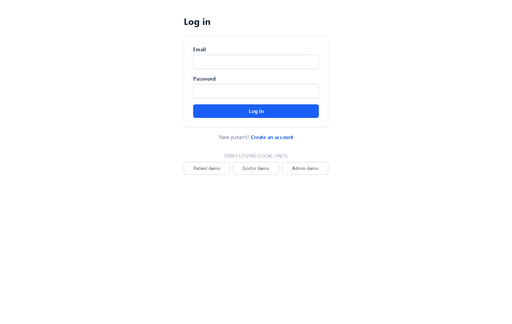
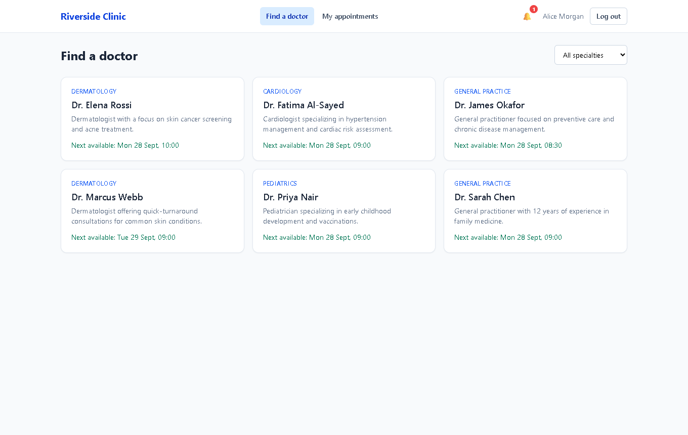
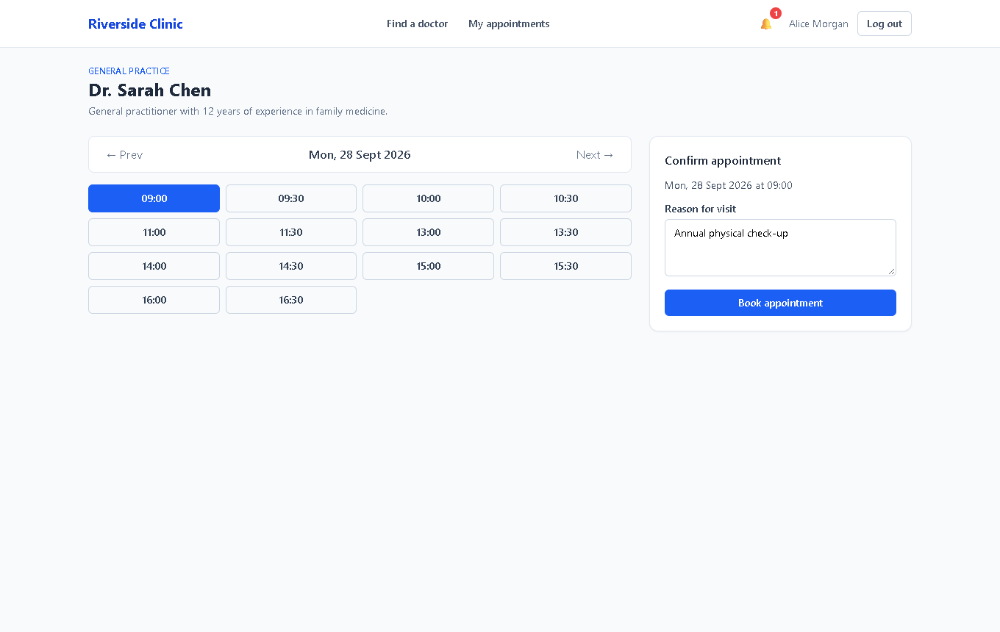
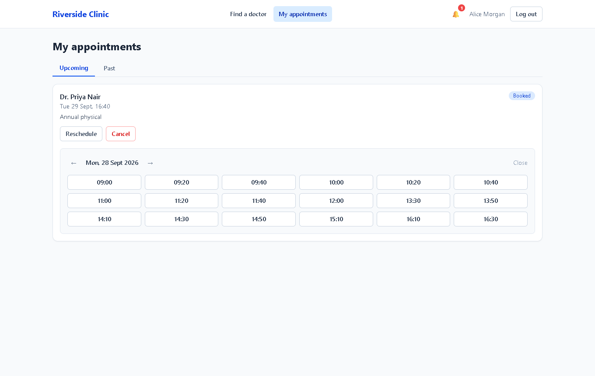
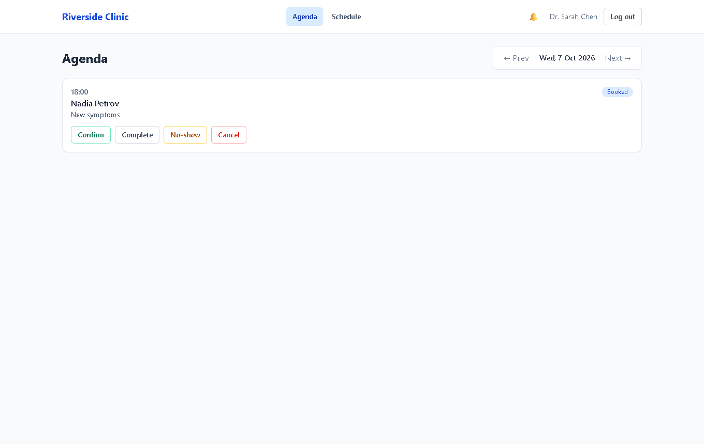
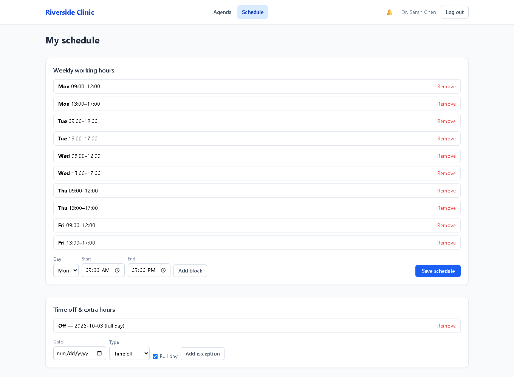
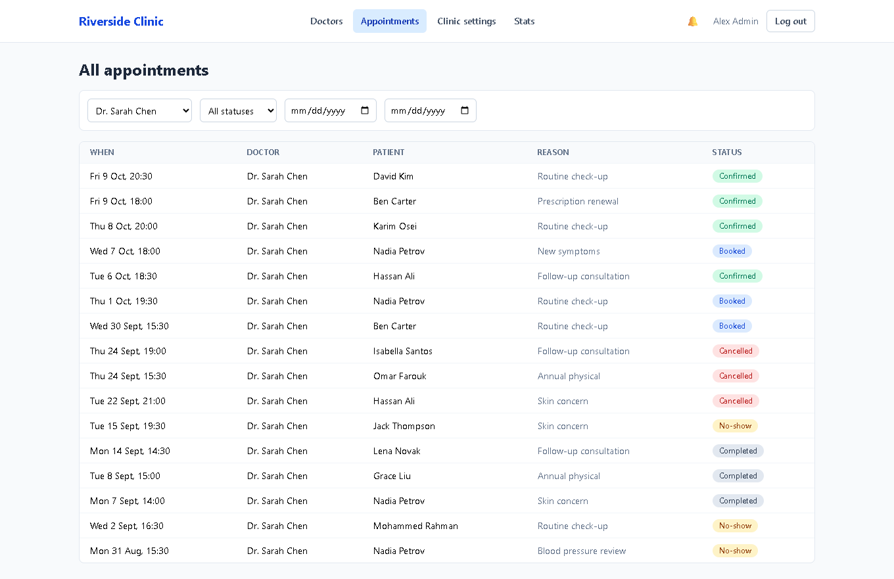
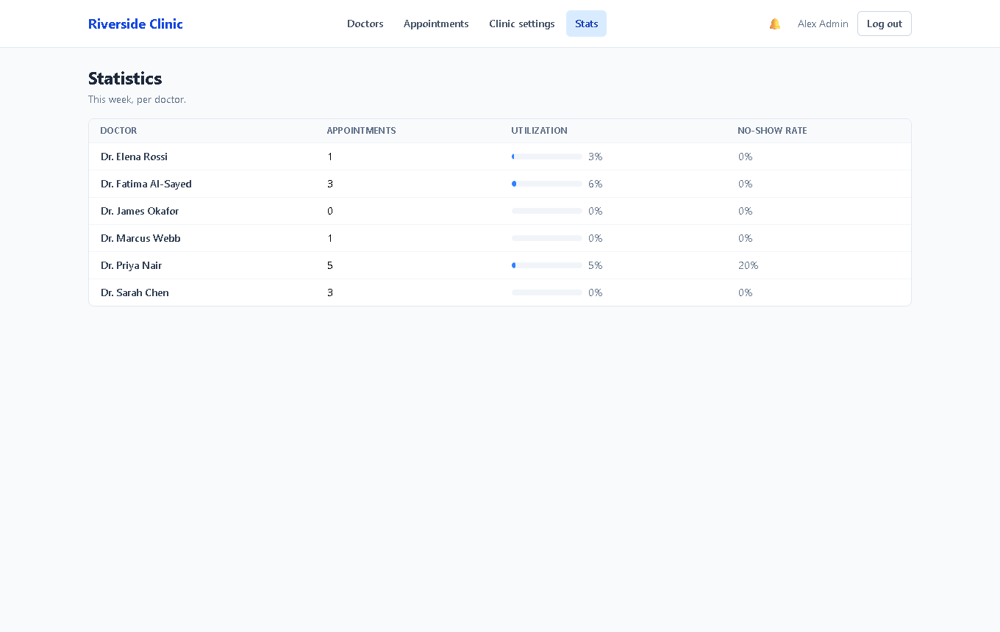
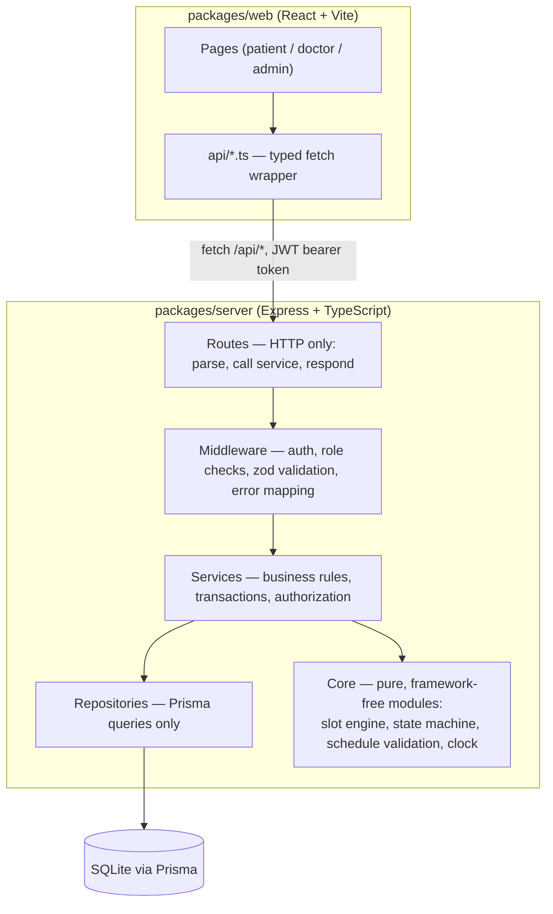

# Riverside Clinic — Appointment System

A booking system for a small multi-doctor clinic: patients book appointments online, doctors manage their weekly availability and daily agenda, and an admin runs the clinic. The core engineering challenge is scheduling — generating correct available time slots on demand and guaranteeing a doctor can never be double-booked, even under concurrent requests.

Runs entirely locally: no cloud services, no paid APIs, no AI/ML.

## Screenshots

| | |
|---|---|
| **Login** — demo login buttons for each role | **Find a doctor** — specialty filter, next-available-slot per doctor |
|  |  |
| **Booking a slot** — day view, lunch break correctly excluded | **My appointments** — reschedule panel open inline |
|  |  |
| **Doctor agenda** — confirm/complete/no-show/cancel actions | **Doctor schedule editor** — weekly blocks + a time-off exception |
|  |  |
| **Admin — all appointments** — filtered by doctor | **Admin — stats** — utilization and no-show rate per doctor |
|  |  |

## Features

- **Patients** self-register, browse/filter doctors by specialty, see each doctor's next available slot, book/reschedule/cancel their own appointments, and see in-app notifications.
- **Doctors** manage their weekly working blocks and one-off exceptions (day off, partial time off, extra hours), see a day agenda, confirm/complete/mark-no-show/cancel appointments, and write private visit notes.
- **Admins** manage doctors, specialties, clinic hours and holidays, see every appointment with filters, and view per-doctor stats (appointment count, utilization, no-show rate).
- A pure, framework-free **slot engine** computes bookable slots on demand from working hours, exceptions, holidays, and existing appointments — nothing is pre-generated or stored.
- An explicit **appointment state machine** with a full event log (`appointment_events`), enforced server-side regardless of what the UI sends.
- A **database-level uniqueness guarantee** against doctor double-booking, proven with a real concurrency test (two simultaneous booking requests, exactly one succeeds).

## Architecture



## Data model

```mermaid
erDiagram
    User ||--o| DoctorProfile : "has (if role=DOCTOR)"
    User ||--o{ Appointment : "books (as patient)"
    User ||--o{ Appointment : "sees (as doctor)"
    User ||--o{ AppointmentEvent : "performs"
    User ||--o{ Notification : "receives"
    Specialty ||--o{ DoctorProfile : "categorizes"
    DoctorProfile ||--o{ ScheduleBlock : "has weekly"
    DoctorProfile ||--o{ ScheduleException : "has one-off"
    Appointment ||--o{ AppointmentEvent : "logs"

    User {
        string id PK
        string name
        string email UK
        string passwordHash
        string role "PATIENT | DOCTOR | ADMIN"
        datetime createdAt
    }
    Specialty {
        string id PK
        string name UK
    }
    DoctorProfile {
        string userId PK_FK
        string specialtyId FK
        string bio
        int slotMinutes
    }
    ClinicSettings {
        int id PK "singleton row"
        string timezone
        int minNoticeMinutes
        int bookingWindowDays
        int patientMaxUpcoming
        int cancelCutoffHours
    }
    ClinicHours {
        string id PK
        int weekday UK
        string openTime
        string closeTime
    }
    ClinicHoliday {
        string id PK
        datetime date UK
        string name
    }
    ScheduleBlock {
        string id PK
        string doctorId FK
        int weekday
        string startTime
        string endTime
    }
    ScheduleException {
        string id PK
        string doctorId FK
        datetime date
        string type "OFF | EXTRA"
        string startTime
        string endTime
    }
    Appointment {
        string id PK
        string patientId FK
        string doctorId FK
        datetime startAt
        datetime endAt
        string status
        string reason
        string cancelReason
        string visitNotes
        string activeSlotKey UK "doctorId+startAt while active, else null"
    }
    AppointmentEvent {
        string id PK
        string appointmentId FK
        string fromStatus
        string toStatus
        string actorId FK
        string note
        datetime createdAt
    }
    Notification {
        string id PK
        string userId FK
        string message
        datetime readAt
        datetime createdAt
    }
```

## Design decisions & trade-offs

### Why slots are computed on demand, not pre-generated and stored

A stored slot table has to be kept in sync with three independently-changing things: the doctor's weekly schedule, one-off exceptions, and the clinic's holidays/hours — any edit to any of them means finding and regenerating every future slot row. Computing on demand ([`slotEngine.ts`](packages/server/src/core/slotEngine.ts)) means there's nothing to go stale: a schedule change is visible on the very next request, for free, with no migration or background job. The engine is a pure function (schedule + exceptions + holidays + existing appointments + "now" → slot list), which also makes it trivial to unit test exhaustively (see `tests/unit/slotEngine.test.ts`) without a database at all.

### How double-booking is prevented at the database level

`Appointment.activeSlotKey` is a nullable, unique string column set to `` `${doctorId}|${startAt.toISOString()}` `` while the appointment is `BOOKED` or `CONFIRMED`, and `null` once it's `COMPLETED`/`NO_SHOW`/`CANCELLED`. SQLite (like most SQL databases) treats `NULL` as distinct from every other `NULL` in a unique index, so terminal appointments never collide with anything, but two *active* appointments for the same doctor at the same instant violate the constraint and the insert fails. This is why application-level checks alone aren't enough: a check-then-insert (`SELECT ... WHERE doctor busy at time; if none, INSERT`) has a race window between the read and the write — two requests can both pass the check before either commits. The [concurrency test](packages/server/tests/integration/concurrency.test.ts) fires two real simultaneous HTTP requests for the same doctor+slot and asserts exactly one succeeds (`201`) and the other is rejected (`409`, caught via the Prisma `P2002` unique-constraint error) — proving the guarantee holds under an actual race, not just in theory. A trade-off documented here: SQLite has no native *partial* unique index, so the generated-key trick stands in for `UNIQUE (doctorId, startAt) WHERE status IN ('BOOKED','CONFIRMED')`, which Postgres could express directly.

### Why appointment status is a state machine with an event log

The lifecycle (`BOOKED → CONFIRMED → COMPLETED|NO_SHOW`, `BOOKED|CONFIRMED → CANCELLED`) has rules that depend on *who* is acting and *when* (only a doctor/admin can mark completed/no-show, and only after the start time; a patient can only cancel outside the cutoff window). Encoding this as an explicit table of allowed transitions plus guard conditions ([`stateMachine.ts`](packages/server/src/core/stateMachine.ts)) means an invalid transition is rejected in one place, consistently, with a clear `409`, rather than being an implicit side-effect of scattered `if` statements across route handlers. Every transition is also recorded in `appointment_events` (from, to, actor, note, timestamp) — an audit trail that answers "who cancelled this and why" without mutating the appointment row itself, and which a stats/reporting feature could later replay independently of the current appointment state.

### Timezone handling

Every timestamp is stored in UTC (`Appointment.startAt`/`endAt`, `AppointmentEvent.createdAt`, etc.). The clinic has one configured IANA timezone (`ClinicSettings.timezone`); the slot engine converts a doctor's wall-clock working hours (`"09:00"`–`"17:00"`) into UTC instants for a given calendar date using that timezone (`date-fns-tz`), so daylight-saving transitions are handled correctly without any special-casing. The frontend fetches the clinic's timezone once (`GET /api/clinic-info`, the one public endpoint that exposes it) and formats every displayed date/time in that zone via `Intl.DateTimeFormat`, so a patient booking from a different timezone still sees "9:00am" meaning clinic-local 9am, not their own.

### What I'd change for multiple locations or recurring appointments

- **Multiple locations**: `ClinicSettings`/`ClinicHours`/`ClinicHoliday` would need a `locationId`, and every doctor/appointment would need to be scoped to a location; the slot engine itself wouldn't change (it already takes clinic hours as a plain argument), but the repository layer would need a location filter everywhere.
- **Recurring appointments**: I'd add a `RecurringSeries` concept that generates individual `Appointment` rows on a rolling window (e.g. the next N occurrences), each still going through the same booking validation and state machine independently — recurrence should be a *generator* of ordinary appointments, not a new kind of appointment, so cancellation/rescheduling of one occurrence doesn't need special-casing.

## How to run

Prerequisites: Node.js 20+, npm.

```bash
cp packages/server/.env.example packages/server/.env
npm install
npm run db:setup
npm run dev:server
```

In a second terminal:

```bash
npm run dev:web
```

Open `http://localhost:5173`. The API runs on `http://localhost:4000`.

(`npm run db:setup` runs Prisma migrations against `packages/server/prisma/dev.db` and populates it with the demo data below.)

## Demo accounts

All seeded accounts use the password `password123`. The login page also has one-click demo login buttons for these three:

| Role    | Email                     |
|---------|---------------------------|
| Admin   | `admin@clinic.local`      |
| Doctor  | `sarah.chen@clinic.local` |
| Patient | `alice.morgan@example.com`|

Five other doctors and fourteen other patients are seeded too (see `packages/server/prisma/seed.ts`).

## How to run the tests

```bash
cd packages/server
cp .env.test.example .env.test
DATABASE_URL="file:./test.db" npx prisma migrate deploy
npm run test
```

`.env.test` points at a separate SQLite database (`test.db`) so tests never touch your dev data. Tests reset the relevant tables between cases and are fully deterministic (dates and clocks are injected, never read from the system clock inside the modules under test).

56 tests cover: the slot engine (normal days, breaks, days off, partial time off, extra blocks, holidays, existing appointments, minimum notice, booking window, a final slot that doesn't fit), the state machine (every valid/invalid transition, the completion/no-show time rule, the 24-hour cancellation rule), booking rules (overlap, max-upcoming, slot-no-longer-free), a real two-request concurrency race, and authorization (patient/patient, doctor/doctor, non-admin/admin-route isolation).

## Project structure

```
clinic-appointment-system/
├── packages/
│   ├── server/
│   │   ├── prisma/            schema, migrations, seed script
│   │   └── src/
│   │       ├── core/           pure logic: slot engine, state machine, clock, errors
│   │       ├── routes/         HTTP layer only
│   │       ├── services/       business rules, transactions, authorization
│   │       ├── repositories/   Prisma queries only
│   │       ├── middleware/     auth, role checks, zod validation, error mapping
│   │       └── schemas/        zod request schemas
│   └── web/
│       └── src/
│           ├── pages/           patient / doctor / admin / auth pages
│           ├── components/      shared UI (layout, nav, states, badges)
│           ├── api/              typed fetch wrapper per domain
│           └── context/          auth state
├── docs/API.md                every endpoint, role, request/response example
└── .github/workflows/ci.yml   lint + typecheck + tests + build on every push/PR
```

## Known limitations & future improvements

- No email/SMS notifications (explicitly out of scope) — only in-app notifications.
- No pagination on the admin appointments list or stats; fine at seed-data scale, would need it at real scale.
- Recurring appointments, multiple clinic locations, and file attachments on visit notes are not implemented (see Design Decisions above for how I'd approach the first two).
- The frontend's reschedule and doctor-schedule editors are functional but minimal — no drag-and-drop calendar editing.
